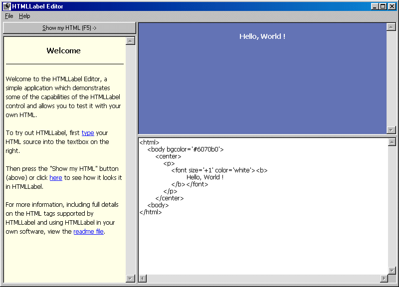



## HTMLLabel v0\.1\.0

### Description

HTMLLabel is a free HTML display control which provides a simple way of displaying HTML within a Visual Basic application.

Version 0.1.0 now supports tables.
 
### More Info
 

             |
---                |---
**Submitted On**   |2001-08-12 17:39:22
**By**             |[Woodbury Associates](https://github.com/Planet-Source-Code/PSCIndex/blob/master/ByAuthor/woodbury-associates.md)
**Level**          |Intermediate
**User Rating**    |4.7 (61 globes from 13 users)
**Compatibility**  |VB 6\.0
**Category**       |[Internet/ HTML](https://github.com/Planet-Source-Code/PSCIndex/blob/master/ByCategory/internet-html__1-34.md)
**World**          |[Visual Basic](https://github.com/Planet-Source-Code/PSCIndex/blob/master/ByWorld/visual-basic.md)
**Archive File**   |[HTMLLabel 245208122001\.zip](https://github.com/Planet-Source-Code/woodbury-associates-htmllabel-v0-1-0__1-26119/archive/master.zip)

